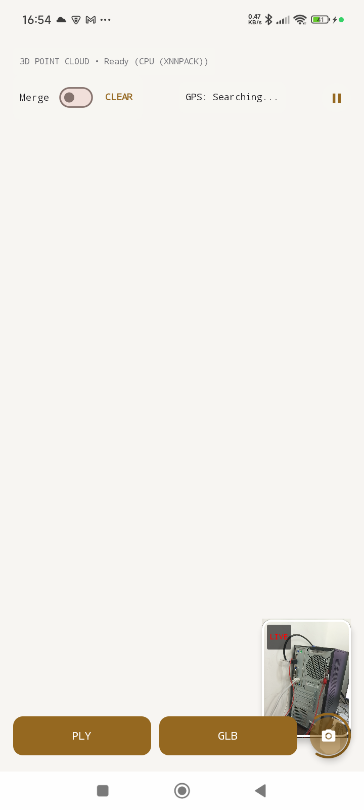
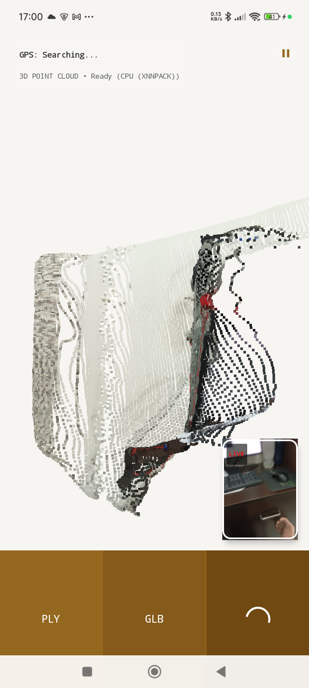
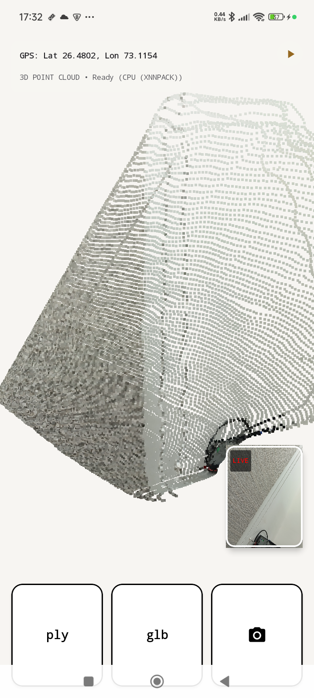
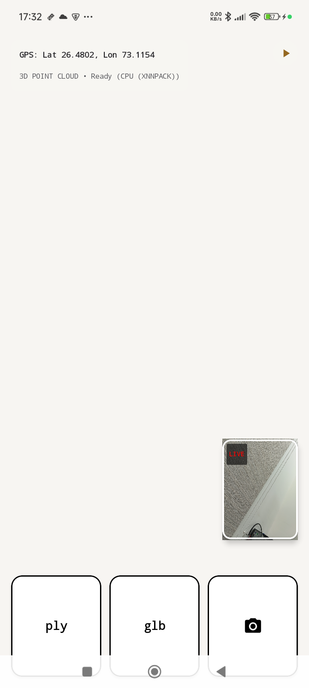
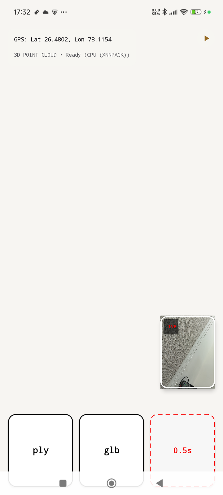
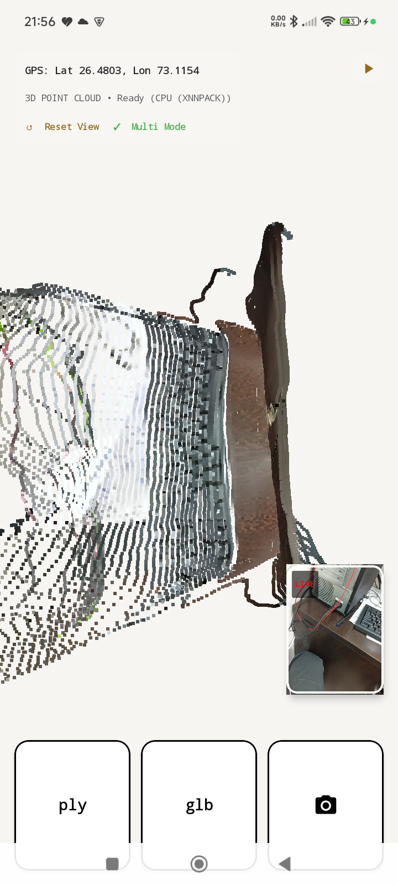
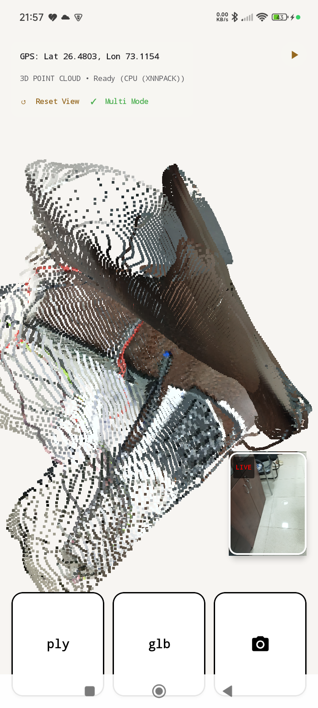
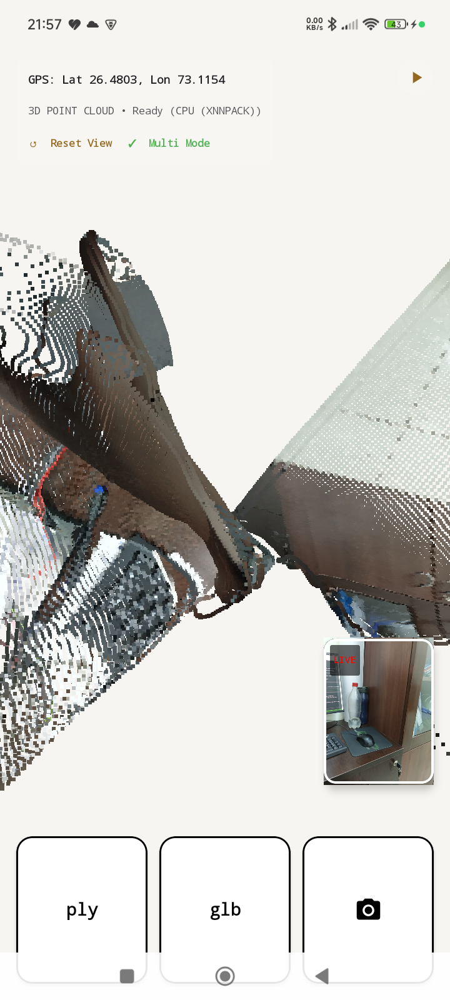

# MoGe3DScanner - Native Live 3D Scanner

A self-contained Android application that performs live 3D reconstruction from single-camera RGB images in real-time, utilizing the **MoGe** monocular geometry model running entirely on-device.

---

### 📸 UI Evolution & Progress

| Generation 1: Split Screen | Generation 2: PiP & Square Panel | Generation 3: Premium Bordered Buttons |
|:---:|:---:|:---:|
|  |  |  |

### 🔘 Shutter Button States

| Idle (Solid Border, Camera Icon) | Active (Red Dashed Border, Live Stopwatch) |
|:---:|:---:|
|  |  |

---

## 🌟 Key Features

1. **On-Device Monocular Depth Estimation**:
   Uses a quantized `moge_v2_fp16.tflite` model running locally via TensorFlow Lite, with support for GPU delegation and CPU (XNNPACK) fallback.

2. **Gravity-Aligned Point Cloud Orientation**:
   At the moment the shutter is tapped, the live `TYPE_ROTATION_VECTOR` sensor matrix is captured and converted to a 4×4 OpenGL column-major matrix. This matrix becomes the **base orientation** of the rendered point cloud — so the scene always appears physically upright (gravity pointing down) immediately after a scan, regardless of how the phone was held.

3. **Turntable Orbital Controls**:
   - **Single-finger drag left/right**: Spins the model around its world-vertical Y-axis.
   - **Single-finger drag up/down**: Tilts the model toward/away from the viewer (no perpendicular roll).
   - **Two-finger pinch**: Zoom in/out.
   - **Two-finger pan**: Translate the model in screen space.
   - **↺ Reset button**: Instantly snaps the view back to the gravity-aligned default orientation, clearing any user-applied rotation and pan.

4. **Multi-Frame Scan Accumulator**:
   A thread-safe `PointCloudAccumulator` merges point clouds from multiple frames on-the-fly with a FIFO cap of 150,000 points for fluid OpenGL ES 2.0 rendering.

5. **GPS Metadata Tagging**:
   Retrieves live location via `LocationManager` and embeds GPS coordinates in:
   * **PLY**: `comment gps_latitude` / `comment gps_longitude` headers.
   * **GLB**: `asset.extras` JSON fields in the glTF binary.

6. **Default Paused Mode & Active Stopwatch**:
   App starts paused to avoid thermal throttling from the heavy ViT model. Tapping the shutter:
   - Captures the current gravity orientation as the new view default.
   - Triggers a single-frame depth inference.
   - Displays a **live ticking stopwatch** (red dashed border) while inference runs.
   - Auto-saves the previous scan to GLB asynchronously in the background.
   - Resets to a **camera icon** (solid black border) when done.

7. **Dual Export Options**:
   * **ply** button: Exports colored point cloud as ASCII `.ply` to Downloads.
   * **glb** button: Exports as binary glTF `.glb` compatible with Blender and standard 3D viewers.

---

## 🏗️ Architecture

| File | Role |
|---|---|
| `MainScreen.kt` | Compose UI, CameraX analyzer, sensor listener, orbital gesture handler, GPS, export |
| `MogeInterpreter.kt` | TFLite model loading, `runForMultipleInputsOutputs`, NIO buffer management |
| `GLPointRenderer.kt` | OpenGL ES 2.0 renderer; `gravityAlignMatrix`, `resetAngles()`, turntable rotation |

---

## ⚙️ Compilation & Deployment

```bash
# 1. Build debug APK
./gradlew assembleDebug --no-configuration-cache

# 2. Install (grant permissions automatically)
adb uninstall com.example.moge3dscanner
adb install app/build/outputs/apk/debug/app-debug.apk
adb shell pm grant com.example.moge3dscanner android.permission.CAMERA
adb shell pm grant com.example.moge3dscanner android.permission.ACCESS_FINE_LOCATION

# 3. Launch
adb shell am start -n com.example.moge3dscanner/.MainActivity
```

---

## 📚 Citations & Acknowledgments

* **MoGe v1 & v2 Models**:
  State-of-the-art monocular geometry estimation by Microsoft Research.
  * *Repository*: [https://github.com/microsoft/MoGe](https://github.com/microsoft/MoGe)

* **3D Live Scanner Historical Legacy**:
  This work builds upon the mobile 3D scanning tradition pioneered by **Luboš Vonásek**:
  > **2017–2021: 3D Live Scanner** *(originally OpenConstructor for Tango, then 3D Scanner for ARCore)*
  > *One of the first apps to bring real-time 3D interior/exterior scanning to Android.*
  > *Source*: [Luboš Vonásek Homepage](https://lvonasek.github.io/)

* **Android CLI & Antigravity CLI**:
  Development and rapid iteration were powered by [Android Platform-Tools](https://developer.android.com/tools/releases/platform-tools) and the [Antigravity CLI](https://antigravity.google/docs) agent platform. Automated build, deployment, screenshot auditing, and remote device command execution enabled fast development cycles directly from the terminal.

* **Pre-compiled Binaries**:
  Download the latest debug APK: [moge_3d_scanner_v10.zip](moge_3d_scanner_v10.zip)

### 🔄 UI Control & Modes

#### 1. Gravity Reset Button (↺) & Multi Mode
The top-left info panel has been updated to support two modes: Single scan (default) and Multi Mode. Tapping "☐ Multi Mode" enables multi-image 3D scanning.



#### 2. Multi-Image 3D Scanning (Panorama Alignment)
When **Multi Mode** is enabled, tapping the shutter button captures consecutive views without clearing the point cloud accumulator. Each frame's points are dynamically rotated in the background using the relative rotation matrix between that frame and the baseline (first frame):
$$P_{aligned} = R_0^T \times R_i \times P_i$$

This allows the user to rotate the camera around a point (like a panorama) to stitch together multiple perspective captures seamlessly in the same coordinate space.

| Frame 1 Captured | Frame 2 (Accumulated Side-by-Side) |
|---|---|
|  |  |

