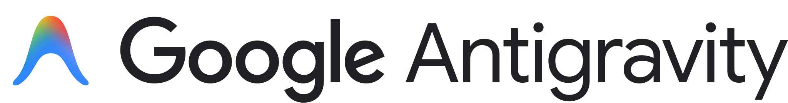

# MoGe3DScanner - Native Live 3D & Thermal Scanner

<p align="center">
  
</p>

<p align="center">
  <a href="https://developer.android.com/blog/posts/android-cli-build-android-apps-3x-faster-using-any-agent">
    
  </a>
</p>

<p align="center">
  <a href="https://antigravity.google/press">
    
  </a>
  &nbsp;&nbsp;&nbsp;&nbsp;&nbsp;&nbsp;
  <a href="https://developer.android.com/blog/posts/android-cli-build-android-apps-3x-faster-using-any-agent">
    
  </a>
  <br><br>
  
  <a href="https://antigravity.google/press">
    
  </a>
  <a href="https://developer.android.com/blog/posts/android-cli-build-android-apps-3x-faster-using-any-agent">
    
  </a>
  
</p>

A self-contained Android application that performs live 3D reconstruction from single-camera RGB images and radiometric thermal cameras in real-time, utilizing the **MoGe** monocular geometry model running entirely on-device.

Crafted with **[Gemini 3.7](https://blog.google/technology/google-deepmind/gemini-model-updates-february-2025/)**, **[Google Antigravity](https://antigravity.google/press)**, and built 3x faster using the official **[Android CLI](https://developer.android.com/blog/posts/android-cli-build-android-apps-3x-faster-using-any-agent)**.

---

## 🌟 Key Features

1. **On-Device Monocular Depth Estimation**:
   Uses a quantized `moge_v2_fp16.tflite` model running locally via TensorFlow Lite, with support for GPU delegation and CPU (XNNPACK) fallback.

2. **Thermal Radiometry & Celsius (°C) Integration**:
   - Seamlessly connects to UVC thermal cameras (HT-203U, InfiRay T2/T3, HIKMICRO `VID:0x2bdf PID:0x0102`) using the standard Android USB Host API.
   - Strict `formatIndex == 1` (`YUY2` 16-bit uncompressed) descriptor negotiation ensuring raw 16-bit microbolometer data ($49,152$ uint16s).
   - Real-time Celsius temperature computation with min/max/center spot tracking.
   - 8-anchor false-color **Ironbow** colormap palette.
   - $90^\circ$ clockwise upright portrait rotation to match the phone's native camera orientation.

3. **Separate Non-Overlapping Floating Preview Cards & Fullscreen Mode**:
   - **Top Floating Card**: Live Thermal Camera feed with real-time temperature stats (`IR • XX.X°C (Min: YY.Y°C, Max: ZZ.Z°C)`).
   - **Bottom Floating Card**: Live RGB Camera feed with `LIVE` status badge.
   - **Fullscreen Toggle (⛶)**: Dedicated expand button on each preview card allowing instant full-screen inspection with a one-tap exit button.
   - Draggable and pinch-to-zoom resizable across the screen without overlapping.

4. **Gravity-Aligned Point Cloud Orientation**:
   At the moment the shutter is tapped, the live `TYPE_ROTATION_VECTOR` sensor matrix is captured and converted to a 4×4 OpenGL column-major matrix. This matrix becomes the **base orientation** of the rendered point cloud — so the scene always appears physically upright (gravity pointing down) immediately after a scan, regardless of how the phone was held.

5. **Simultaneous Multi-Sensor Snapshot Archival**:
   Tapping the shutter button automatically captures and archives all data to `/sdcard/Download/`:
   - `moge_rgb_<timestamp>.png`: Full-resolution RGB photo.
   - `moge_thermal_<timestamp>.png`: Colorized thermal heatmap snapshot.
   - `moge_thermal_<timestamp>.raw`: Raw 16-bit radiometric microbolometer counts.
   - `moge_scan_<timestamp>.glb`: 3D point cloud mesh textured with thermal data.

6. **Turntable Orbital Controls**:
   - **Single-finger drag left/right**: Spins the model around its world-vertical Y-axis.
   - **Single-finger drag up/down**: Tilts the model toward/away from the viewer (no perpendicular roll).
   - **Two-finger pinch**: Zoom in/out.
   - **Two-finger pan**: Translate the model in screen space.
   - **↺ Reset button**: Instantly snaps the view back to the gravity-aligned default orientation, clearing any user-applied rotation and pan.

7. **Multi-Frame Scan Accumulator**:
   A thread-safe `PointCloudAccumulator` merges point clouds from multiple frames on-the-fly with a FIFO cap of 150,000 points for fluid OpenGL ES 2.0 rendering.

8. **GPS Metadata Tagging**:
   Retrieves live location via `LocationManager` and embeds GPS coordinates in:
   * **PLY**: `comment gps_latitude` / `comment gps_longitude` headers.
   * **GLB**: `asset.extras` JSON fields in the glTF binary.

---

## 🏗️ Architecture

| File | Role |
|---|---|
| `MainScreen.kt` | Compose UI, CameraX analyzer, sensor listener, orbital gesture handler, dual floating cards, fullscreen overlays, GPS, export |
| `MogeInterpreter.kt` | TFLite model loading, `runForMultipleInputsOutputs`, NIO buffer management |
| `GLPointRenderer.kt` | OpenGL ES 2.0 renderer; `gravityAlignMatrix`, `resetAngles()`, turntable rotation |
| `ThermalCameraManager.kt` | Thermal UVC capture manager, radiometric frame decoding, Celsius conversions, and 90° upright portrait rotation |
| `thermal/` (`BulkUvc`, `Xtherm`, `UsbDesc`) | Standard Android USB Host UVC driver, InfiRay/HT-203U radiometry, and 8-anchor Ironbow LUT |

---

## ⚙️ Android CLI Build & Deployment

Built with the official **[Android CLI](https://developer.android.com/blog/posts/android-cli-build-android-apps-3x-faster-using-any-agent)** and Command-Line Tools:

```bash
# 1. Build debug APK via Gradle
./gradlew assembleDebug

# 2. Wireless ADB Connection & Clean Installation
adb connect <PHONE_IP>:<PORT>
PKG=$(adb shell pm list packages com.example.moge3dscanner | grep moge || true)
if [ -n "$PKG" ]; then
    adb uninstall com.example.moge3dscanner
fi
adb install -t -g app/build/outputs/apk/debug/app-debug.apk

# 3. Grant Runtime Permissions & Launch
adb shell pm grant com.example.moge3dscanner android.permission.CAMERA
adb shell pm grant com.example.moge3dscanner android.permission.ACCESS_FINE_LOCATION
adb shell pm grant com.example.moge3dscanner android.permission.ACCESS_COARSE_LOCATION
adb shell am start -n com.example.moge3dscanner/.MainActivity
```

---

## 📚 Citations & References

* **Google DeepMind & Gemini 3.7**:
  * *Gemini 3.7 Release*: [https://blog.google/technology/google-deepmind/gemini-model-updates-february-2025/](https://blog.google/technology/google-deepmind/gemini-model-updates-february-2025/)
  * *Gemini 3.7 Flash Image*: [https://storage.googleapis.com/gweb-uniblog-publish-prod/images/gemini-3-7-flash.width-1600.format-webp.webp](https://storage.googleapis.com/gweb-uniblog-publish-prod/images/gemini-3-7-flash.width-1600.format-webp.webp)
  * *Google Antigravity Press Assets & Full Color Lockup*: [https://antigravity.google/press](https://antigravity.google/press)

* **Android Developer Tools & CLI**:
  * *Android CLI Article*: [https://developer.android.com/blog/posts/android-cli-build-android-apps-3x-faster-using-any-agent](https://developer.android.com/blog/posts/android-cli-build-android-apps-3x-faster-using-any-agent)
  * *Android Developer Tools*: [https://developer.android.com/tools](https://developer.android.com/tools)

* **MoGe v1 & v2 Models**:
  State-of-the-art monocular geometry estimation by Microsoft Research.
  * *Repository*: [https://github.com/microsoft/MoGe](https://github.com/microsoft/MoGe)

* **HT203U Thermal Camera Integration**:
  UVC-over-bulk USB streaming and InfiRay / Xtherm radiometry ported from **HT203U-Thermal** and **R_e/thermal**:
  * *Repository*: [https://github.com/cfbird/HT203U-Thermal](https://github.com/cfbird/HT203U-Thermal)
  * *Thermal Processing & Colormap*: [https://github.com/1kaiser/R_e/tree/main/thermal](https://github.com/1kaiser/R_e/tree/main/thermal)
  * *Radiometric calibration math*: [stawel/ht301_hacklib](https://github.com/stawel/ht301_hacklib)

* **3D Live Scanner Historical Legacy**:
  This work builds upon the mobile 3D scanning tradition pioneered by **Luboš Vonásek**:
  * *Repository*: [https://github.com/lvonasek/binary_live3dscanner](https://github.com/lvonasek/binary_live3dscanner)
