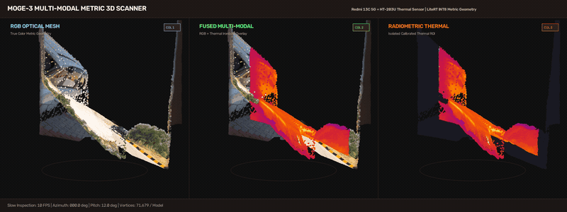
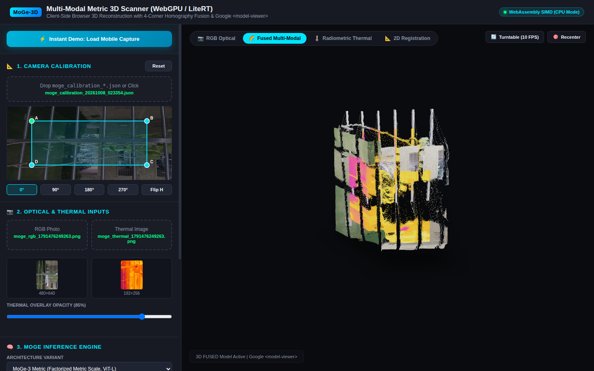

# Mobile 3D Scanning & Computer Vision Suite

A comprehensive collection of on-device 3D reconstruction, multi-sensor computer vision, thermal radiometry, and augmented reality applications for Android.

---

## 🌟 Featured Applications

### 1. [MoGe3DScanner](./MoGe3DScanner) — Live 3D & Thermal Scanner
* **On-Device Monocular Metric 3D Geometry**: Powered by **MoGe-3 LiteRT INT8** (ViT-L) running locally with GPU / CPU XNNPACK delegation, predicting metric 3D point clouds in true meters.
* **2D Thermal Frame Fusion**: Registered 16-bit radiometric thermal heatmap over RGB frames via hardware-accelerated 4-corner perspective homography (`moge_fused_<ts>.png`).
* **Triple 3D GLB Generation**: Simultaneous generation and real-time in-app switching between **Fused 3D**, **Pure Thermal 3D**, and **Pure RGB 3D** models.
* **Native 3D Viewers**: Turntable orbital controls rendered via **Google Filament** and Google **`<model-viewer>`**.
* 📥 **[Download MoGe3DScanner v2.0 (MoGe-3 Metric, 456 MB)](https://github.com/1kaiser/binary_live3dscanner/releases/download/v2.0/MoGe3DScanner_v2.0.apk)**
* 📥 **[Download MoGe3DScanner v2.0 (MoGe v2 Lightweight, 132 MB)](https://github.com/1kaiser/binary_live3dscanner/releases/download/v2.0/MoGe3DScanner_v2.0_moge2.apk)**

<p align="center">
  
</p>

### 2. [MultiCamApp](./MultiCamApp) — Concurrent Multi-Camera & Dual Recording
* Streams, photographs, and records from multiple camera sensors concurrently (Front, Rear Main, Rear Aux/Depth) using Camera2 APIs.
* Non-overlapping floating PiP cards and split viewports.
* 📥 **[Download MultiCam Live v1.0 APK](https://github.com/1kaiser/binary_live3dscanner/releases/tag/multicam-v1.0)**

### 3. [WebGPU / Browser 3D Scanner & Multi-Modal Studio](./web/) — Interactive Web Suite
* **Zero-Install Client-Side Web Application**: Standalone HTML/JS suite running directly in modern desktop browsers (Chrome, Edge, Firefox, Brave) with WebGPU hardware acceleration and WebAssembly SIMD CPU fallback.
* **4-Corner Homography Calibration Canvas**: Interactive draggable quad anchors ($A, B, C, D$) with real-time perspective warping and rotation/flip alignment matching native Android `Matrix.setPolyToPoly`.
* **In-Browser Binary GLB Generator**: Generates glTF 2.0 binary `.glb` point clouds on-the-fly directly inside the browser using structured `ArrayBuffer` / `DataView` packing without requiring backend servers.
* **Google `<model-viewer>` Integration**: Interactive 3D orbital inspection, 10 FPS turntable slow-rotation standard ($30^\circ/\text{s}$), multi-modal switching (`RGB`, `Fused`, `Thermal`, `2D Registration`), and one-click GLB exports.
* **Instant Demo Support**: Built-in one-click demo dataset loading calibrated mobile captures and pre-inferred models (`?autoload=true`).

<p align="center">
  
</p>

---

## 📦 Releases

Pre-compiled APKs and historical release archives are hosted under [GitHub Releases](https://github.com/1kaiser/binary_live3dscanner/releases):

| Application | Latest Version | Release Assets |
| :--- | :--- | :--- |
| **MoGe3DScanner** | **v2.0** | [Release v2.0](https://github.com/1kaiser/binary_live3dscanner/releases/tag/v2.0) ([MoGe-3 456MB](https://github.com/1kaiser/binary_live3dscanner/releases/download/v2.0/MoGe3DScanner_v2.0.apk) \| [MoGe-2 132MB](https://github.com/1kaiser/binary_live3dscanner/releases/download/v2.0/MoGe3DScanner_v2.0_moge2.apk)) |
| **MultiCam Live** | **v1.0** | [Release multicam-v1.0](https://github.com/1kaiser/binary_live3dscanner/releases/tag/multicam-v1.0) |
| **Historical Archives** | **v3 – v32** | [All Releases](https://github.com/1kaiser/binary_live3dscanner/releases) |

---

## 🛠️ Quick Start

### Building MoGe3DScanner via Android CLI / Gradle

```bash
cd MoGe3DScanner

# 1. Download MoGe-3 LiteRT INT8 model (324 MB) from Hugging Face
./download_models.sh

# 2. Build Debug APK
./gradlew assembleDebug

# Output APK: app/build/outputs/apk/debug/app-debug.apk
```

---

## 📚 Acknowledgments & References

* **Google DeepMind & Gemini 3.7**: [Gemini Model Updates](https://blog.google/technology/google-deepmind/gemini-model-updates-february-2025/)
* **Google Antigravity**: [Antigravity Press](https://antigravity.google/press)
* **Microsoft Research MoGe**: [MoGe Repository](https://github.com/microsoft/MoGe)
* **MoGe-3 LiteRT Quantized Models**: Hosted on Hugging Face at [`1kaiser/moge3-litert`](https://huggingface.co/1kaiser/moge3-litert)
* **3D Live Scanner Legacy**: Originally pioneered by [Luboš Vonásek](https://github.com/lvonasek/binary_live3dscanner)
